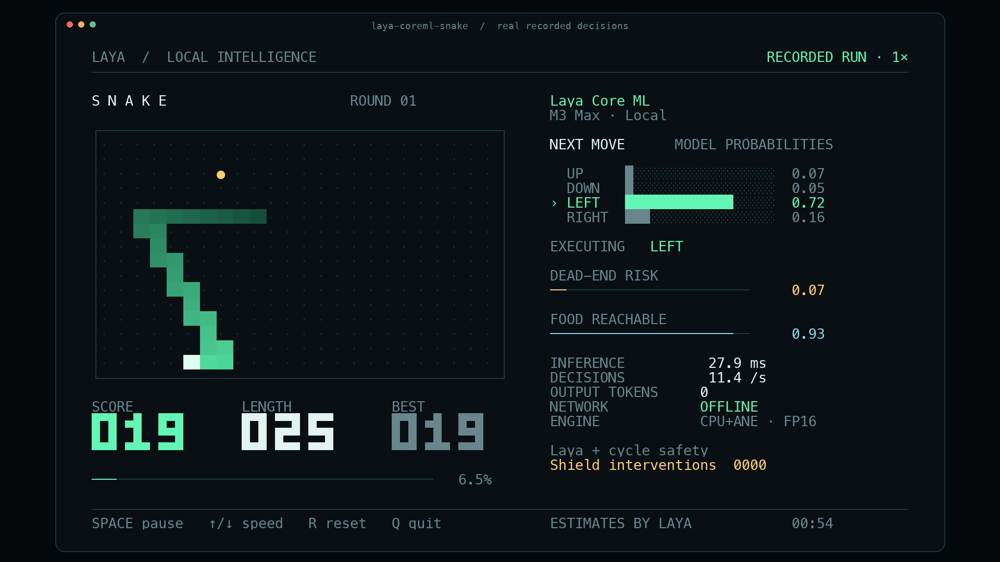

# Shareable Snake demo



The README opens with a **15-second GIF** of a real Core ML terminal run. The
matching **20-second, 1920×1080 MP4** is suitable for a social post. Both replay
the original recording at **1× wall-clock speed**.

- [Download the MP4](https://raw.githubusercontent.com/mizorewww/laya-coreml/main/docs/assets/snake-demo.mp4)
- [Download the GIF](https://raw.githubusercontent.com/mizorewww/laya-coreml/main/docs/assets/snake-demo.gif)
- [Preview PNG](assets/snake-preview.png)
- [Media provenance and renderer hashes](assets/snake-demo.json)
- [Original 75-second decision recording](../benchmarks/results/coreml-snake-showcase.jsonl)

## What was recorded

The installed `laya-coreml` wheel ran in a real 112-column × 38-row pseudo-terminal
on an M3 Max. The model was downloaded from the public, pinned ANE FP16 Hub
snapshot before the game started. Gameplay ran offline with the Core ML runtime,
without Torch, Transformers or MLX installed in that environment.

| Setting or result | Value |
|---|---:|
| Board / seed | 24×16 / 7 |
| Initial snake length | 6 |
| Requested presentation rate | 12 decisions/s |
| Actual run duration | 75.034 s |
| Fresh decision calls / executed moves | 855 / 855 |
| Observed decision rate | 11.395/s |
| Final score / length | 26 / 32 |
| Deaths / safety interventions | 0 / 0 |
| Three-question `predict` P50 / P95 | 26.63 / 28.09 ms |
| Model output tokens | 0 |
| MP4 excerpt | Seconds 45–65, 30 video frames/s |
| GIF excerpt | Seconds 45–60, 10 video frames/s |
| Still preview | Second 55 |

Video frames sample the original decisions. They do not trigger additional
predictions or speed up the snake. The renderer uses the same terminal-cell
composition as the live UI and labels exports `RECORDED RUN · 1×`. The GIF is
about 1.6 MB; the MP4 is about 0.7 MB.

The model receives exact planner features. A cycle safety layer is enabled and
its intervention counter remains visible, even though this run needed no
overrides. Zero deaths here are a bounded observation, not evidence of unlimited
unassisted gameplay. The displayed risk and food reachability are model estimates.

The UI's inference timer includes **three sequential typed questions**. The
separate 4.98 ms benchmark measures **one short question** under sustained load.
These workloads, pacing and timing boundaries differ. Full game-loop rate tests
are in [SNAKE_BENCHMARKS.md](SNAKE_BENCHMARKS.md).

## Reproduce the recording

Install `laya-coreml[demo]==0.1.0`, download the pinned model from
[RELEASE.md](RELEASE.md), and run:

```bash
laya-coreml-snake --model ./models/ane --seed 7 --fps 12 \
  --duration 75 --record snake.jsonl
laya-coreml-snake export snake.jsonl --start 45 --seconds 20 \
  --output snake-demo.mp4 --gif snake-demo.gif --gif-seconds 15
laya-coreml-snake export snake.jsonl --start 55 --output snake-preview.png
```

For a scripted real-terminal capture, the source checkout includes
`scripts/record_terminal.py`:

```bash
python scripts/record_terminal.py --log artifacts/session.ansi -- \
  laya-coreml-snake --model ./models/ane --seed 7 --fps 12 \
  --duration 75 --record snake.jsonl
```

## Suggested post text

English:

> A 322M decision model playing Snake on my Mac's Neural Engine. Zero generated
> tokens. Offline inference, live probabilities, and a visible safety layer.
> Core ML runtime, open weights, reproducible benchmarks:
> https://github.com/mizorewww/laya-coreml

中文：

> 把一个 3.22 亿参数的决策模型搬到了 Mac 的 Neural Engine 上，用它实时玩贪吃蛇。
> 概率实时变化，0 个生成 token，下载模型后完全离线。视频是原速实录，安全层和干预
> 次数直接显示在界面上。代码、权重、PyPI 包和完整 benchmark 都已开放：
> https://github.com/mizorewww/laya-coreml

For a performance-focused follow-up, use the exact claim: **4.98 ms P50 for one
short multilingual decision, with 2.78× lower estimated system energy per
decision than compiled MLX FP16 in the paired M3 Max experiment**. Link the
[measurement method](ANE_BENCHMARKS.md), keep its workload qualification, and do
not label it a Snake frame time or a 10× result.
